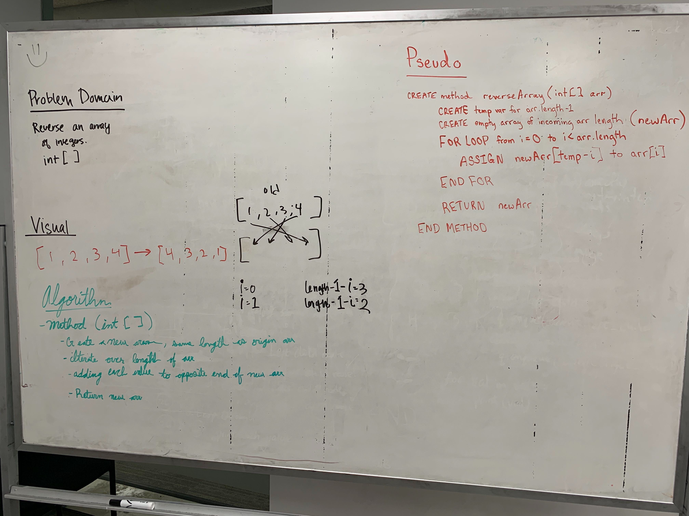

**Data Structures and Algorithms**

# Reverse and Array
Write a method to reverse an array of integers.

## Challenge
This challenge is to create a method which takes in an array of integers,
reverse the array, return the reversed array, and print out the reversed
array. This challenge is to be completed without using any of the built-in
methods.

## Approach and Efficiency
For this challenge, our group decided that it would be best write a method
which takes in one parameter - an int array. 
* Next, a new array would be created that had the same length as the original array.
* Next, a temp variable would be created to hold the length of the array. 
* Next, a FOR loop would be used to iterate over the length of the array and assign the values from the old array to the new array. 
  * This step would be accomplished by:
    * using the taking the new array at the temp value minus the iterator value
    * then assigning value of the old array at that index to the new array
* Next, the new array would be returned by the method.
* Finally, the main method would print the returned array using the Arrays.toString() method.

## Collaboration
* Jane Hur
* Chris Coulon

## Solution

