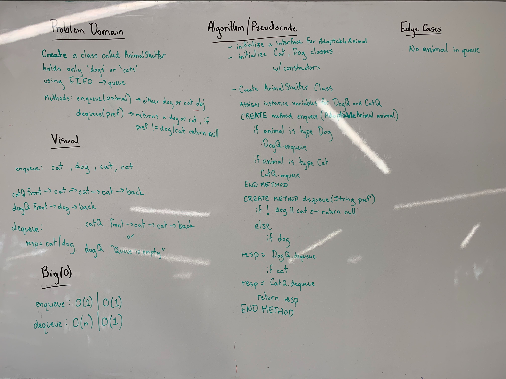

## Pseudoqueue
Create an Animal Shelter class which holds only dogs and cats and is first-in-first-out.

### Links
* src/main/utilities
  * [AdoptableAnimal.java](../code401challenges/src/main/java/utilities/AdoptableAnimal.java)
  * [AnimalShelter.java](../code401challenges/src/main/java/utilities/AnimalShelter.java)
  * [Cat.java](../code401challenges/src/main/java/utilities/Cat.java)
  * [Dog.java](../code401challenges/src/main/java/utilities/Dog.java)
* src/test/utilities
  * [AnimalShelterTest.java](../code401challenges/src/test/java/utilities/AnimalShelterTest.java)

### Challenge
Create a Class `AnimalShelter` that has the methods `enqueue(AdoptableAnimal animal)` and `dequeue(String animalPreference)` which holds only `Dog` and `Cat` and acts in a first-in-first-out approach.

### Approach and Efficiency
* Approach:
  * Utilize the methods from the `Queue` class to enable use of the prebuild `enqueue(T value)` and `dequeue()` methods. Also utilize an interface `AdoptableAnimal` and classes `Dog` and `Cat` to create the structure to hold the correct animal objects.
* Variables:
  * `Queue<AdoptableAnimal> dogQueue`
  * `Queue<AdoptableAnimal> catQueue`
* Methods:
  * `public boolean isEmpty()`
    * checks if both queues are empty
  * `public void enqueue(AdoptableAnimal animal)`
    * pushes `animal` into the correct queue based on the object type
  * `public AdoptableAnimal dequeue(String animalPreference)`
    * returns the first animal object of the specified `animalPreference`
  * `private String getAnimalQueue()`
    * returns a response will all the animals in each queue.
  * `public String toString()`
    * returns the response built in `getAnimalQueue()`
* Time and Space:
  * `enqueue(T value)`
    * T: O(1)
    * S: O(1)
  * `dequeue()`
    * T: O(n)
    * S: O(1)

### Collaboration
* Matt Stuhring
* Melfi Perez
* Renee Messick
* Travis Cox
* [Object belongs to a class](https://stackoverflow.com/questions/4294844/check-if-an-object-belongs-to-a-class-in-java)

### Solution
