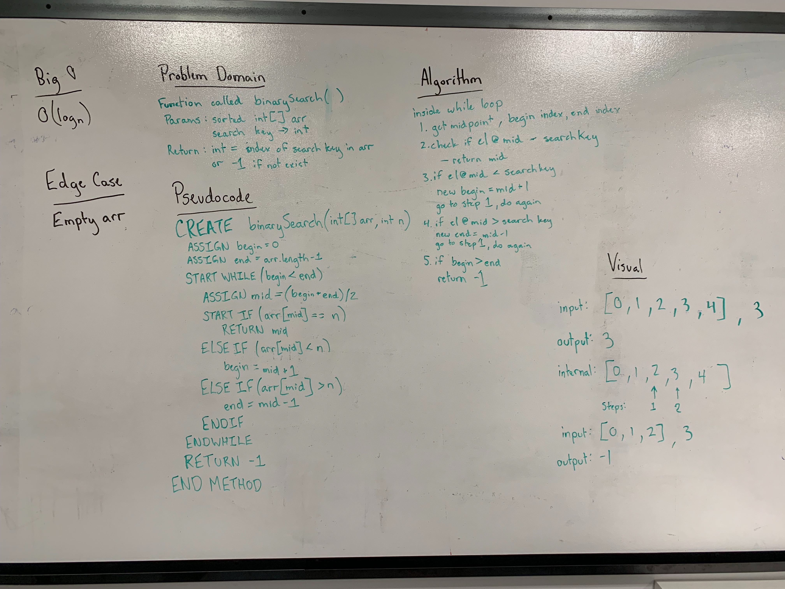

## Binary Search
Write a method to perform binary search on an array of integers.

[Link to the Code](../code401challenges/src/main/java/code401challenges/BinarySearch.java)

[Link to the Tests](../code401challenges/src/test/java/code401challenges/BinarySearchTest.java)

### Challenge
This challenge is to create a method which takes in a sorted integer array and a item to search for. This method will use a binary search to iterate through the array and then return the index the item searched for is located within the array. This challenge is to be completed without using any of the built-in
methods.

### Approach and Efficiency

### Collaboration

### Solution
