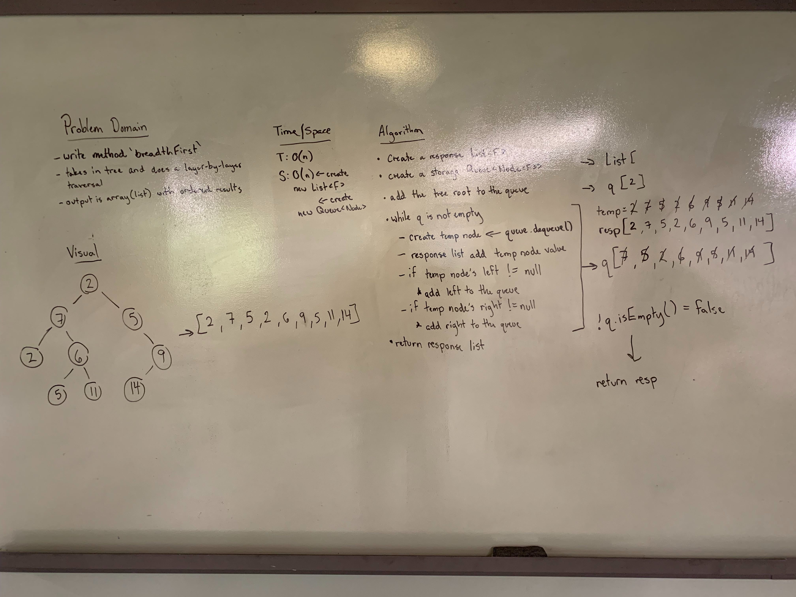

## Breadth First
Create a static method which returns a List of the tree nodes in their breadth (layer-by-layer) from the root to the lowest branch.

### Links
* src/main/tree
  * [Tree.java](../code401challenges/src/main/java/tree/Tree.java)
* src/test/tree
  * [TreeTest.java](../code401challenges/src/main/java/tree/TreeTest.java)

### Challenge
Create a  method called `breadthFirst(Tree<F> tree)` which changes returns a list of the nodes in breadth order (layer-by-layer) from the root to the lowest branch opf the tree.

### Approach and Efficiency
* Approach:
  * Build an iterative method which utilizes a queue and adds each node, per level of the tree, to a list to return. Use a while loop to dequeue the current node from the queue and add it to the response list and then add the current node's left and right values to the end of the queue.
* Method:
  * `public static <F> List<F> breadthFirst(Tree<F> tree)`
* Time and Space:
  * `public static <F> List<F> breadthFirst(Tree<F> tree)`
    * T: O(n)
    * S: O(n) - create a new `List<F>` and `Queue<Node<F>>`

### Collaboration/Resources
* [Level Order Traversal](https://www.geeksforgeeks.org/level-order-tree-traversal/)

### Solution
