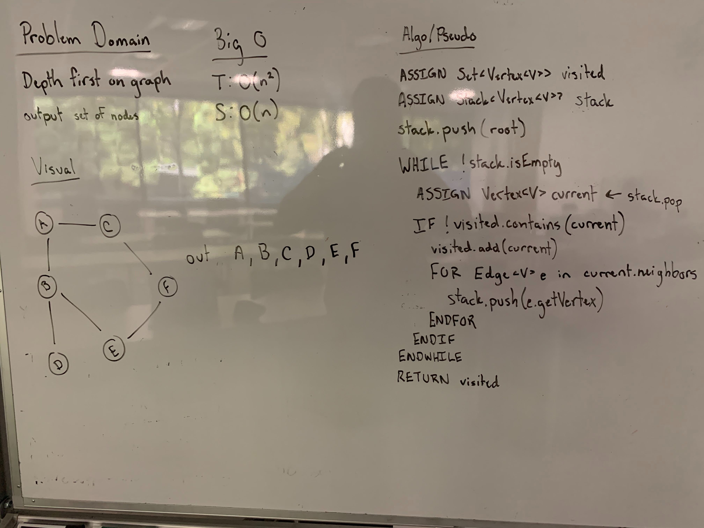

## Depth First Graph
Create a static method which returns a Set of the Graph vertices in a depth first orientation based off of any root vertex added.

### Links
* src/main/graph
  * [Graph.java](../code401challenges/src/main/java/graph/Graph.java)
* src/test/graph
  * [GraphTest.java](../code401challenges/src/test/java/graph/GraphTest.java)

### Challenge
Create a  method called `depthFirst(Graph<F> graph, Vertex<F> root)` which changes returns a set of the nodes in breadth order (layer-by-layer) from the specified root.

### Approach and Efficiency
* Method:
  * `public static <F> Set<Vertex<F>> breadthFirst(Graph<F> graph, Vertex<F> root)`
* Time and Space:
  * `public static <F> Set<Vertex<F>> breadthFirst(Graph<F> graph, Vertex<F> root)`
    * T: O(n^2)
    * S: O(n) - create a new `Set<F>`, `Stack<Vertex<F>>`, and `Vertex<F>`

### Collaboration/Resources
* [Baeldung Graph](https://www.baeldung.com/java-graphs)

### Solution

