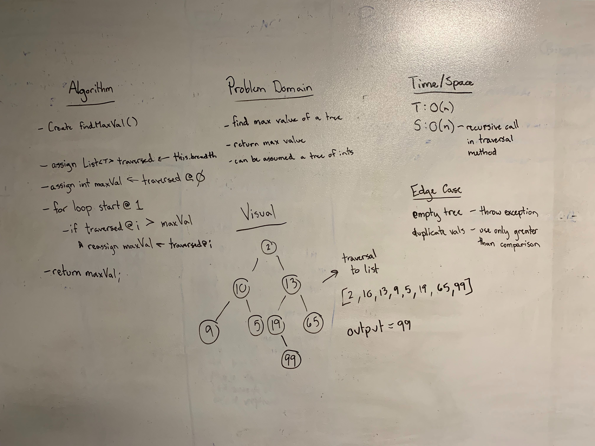

## Find Maximum Value
Create a method which returns the maximum value in the tree.

### Links
* src/main/tree
  * [Tree.java](../code401challenges/src/main/java/tree/Tree.java)
* src/test/tree
  * [TreeTest.java](../code401challenges/src/main/java/tree/TreeTest.java)

### Challenge
Create a  method called `findMaximumValue()` which changes returns the maximum value of a tree. This method assumes that the tree is of type `Integer`

### Approach and Efficiency
* Approach:
  * Build a method which calls one of the traversal methods. After calling the traversal method it will iterate over the returned list and assign the greatest value from that list to an `int` variable and return that value.
* Method:
  * `public int findMaximumValue()`
* Time and Space:
  * `public int findMaximumValue()`
    * T: O(n)
    * S: O(n) - space used in the stack space of the helper method.

### Collaboration/Resources
* [Use of instanceOf with Generics](https://riptutorial.com/java/example/12864/use-of-instanceof-with-generics)

### Solution
