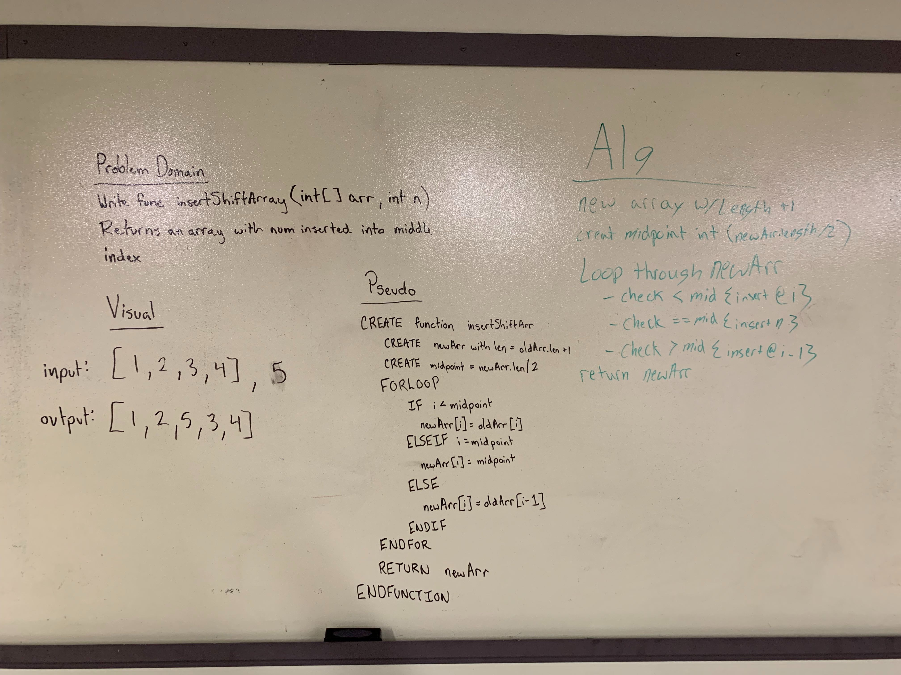

## Insert Shift Array
Write a method to insert a value into the middle of an array without
using an ArrayList.

[Link to the Code](../code401challenges/src/main/java/code401challenges/ArrayShift.java)

[Link to the Tests](../code401challenges/src/test/java/code401challenges/ArrayShiftTest.java)

### Challenge
This challenge is to take an array of integers and add a new integer to
the middle of the array. This must be accomplished without using any of
the build-in methods and without the use of an ArrayList.

### Approach and Efficiency
We approached this by creating a function which takes in an integer array and a value to be added and returns a new integer array.
* First: initialize the function
* Second: initialize var len to the value of old array length + 1
* Third: intialize a new array with the length of len
* Fourth: initialize a middle value with new array length / 2
* Fifth: FOR loop through the new array to add the values in. Use conditional checks to insert correct values
  * IF iterator < middle value : have new array @ iterator = old array @ iterator
  * IF iterator == middle value : have new array @ iterator = value to be added
  * IF iterator > middle value : have new array @ iterator = old array @ iterator - 1
* Sixth: return the new array

### Collaboration
* Trevor Dobson

### Solution
