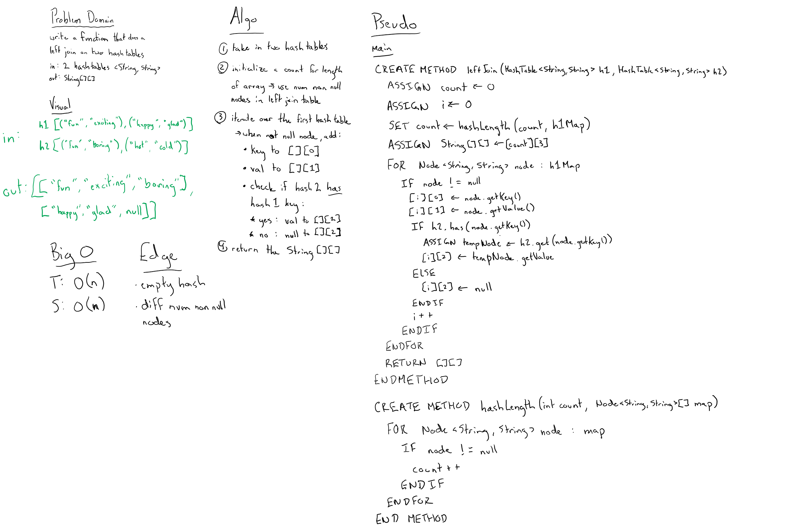

## Tree Intersection
Left joins two Hash Tables into one data structure.

### Links
* src/main/TreeIntersection
  * [LeftJoin.java](../code401challenges/src/main/java/hashTable/LeftJoin.java)
* src/test/TreeIntersection
  * [LeftJoinTest.java](../code401challenges/src/test/java/hashTable/LeftJoinTest.java)

### Challenge
Create a  method called `leftJoin(HashTable<K,V> hashTable1, HashTable<K,V> hashTable2)` which takes in two hash tables and left joins them into one data structure and returns the result of that join.

### Approach and Efficiency
* Approach:
* Method:
  * `public static <K,V> String[][] leftJoin(HashTable<K,V> hashTable1, HashTable<K,V> hashTable2)`
  * `private static int mapNotNullLength(Node<String,String>[] map)`
* Time and Space:
  * `public static <K,V> String[][] leftJoin(HashTable<K,V> hashTable1, HashTable<K,V> hashTable2)`
    * T: O(n)
    * S: O(n)
  * `private static int mapNotNullLength(Node<String,String>[] map)`
    * T: O(n)
    * S: O(1)

### Collaboration/Resources
* Travis Cox
* Matt Stuhring
* Jack Kinne
* Melfi Perez
* Renee Messick

### Solution

