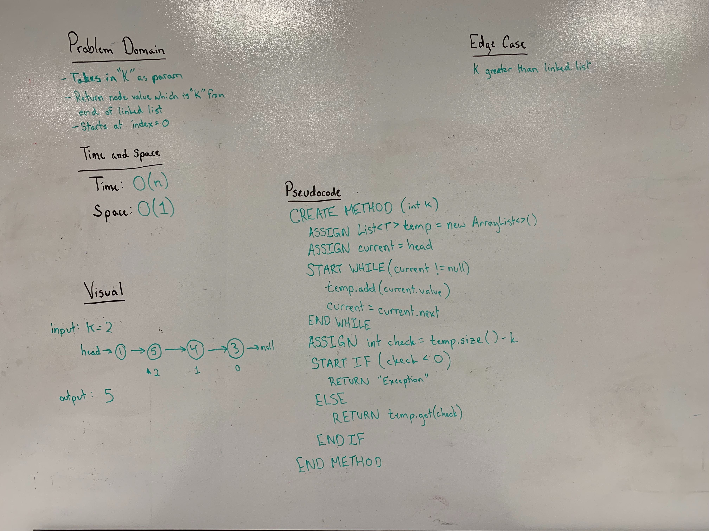

## Linked List Insertions
Write a method which takes in a value as a parameter and returns the value that is the at that distance from the end of the linked list. 

Example: 1 -> 2 -> 3 -> 4 -> null ; value 1 from end ; return 3 

### Links
* [LinkedList.java](../code401challenges/src/main/java/linkedList/LinkedList.java) 
* [Node.java](../code401challenges/src/main/java/linkedList/Node.java)
* [LinkedListTest.java](../code401challenges/src/test/java/linkedList/LinkedListTest.java)

### Challenge
* Write a method called `kthFromEnd` which takes in a value that represents how far back from the end of the linked list to find. It then returns the value at that distance from the end - the last linked list item is considered to be `index = 0`

### Approach and Efficiency
* The method `kthFromEnd(T value)` will use an `ArrayList<T>` to store the values from the linked list, use a `current` to get the current value and a `while` loop to iterate one time over the linked list. This loop will add all the values from the linked list as a "temporary storage" and then be able to use `.get(list.length - k)` to produce the kth value.
* Time and Space Efficiency
  * `kthFromEnd(T value)`
    * Time: O(n)
    * Space: O(1)

### Collaboration
* Travis Cox

### Solution

