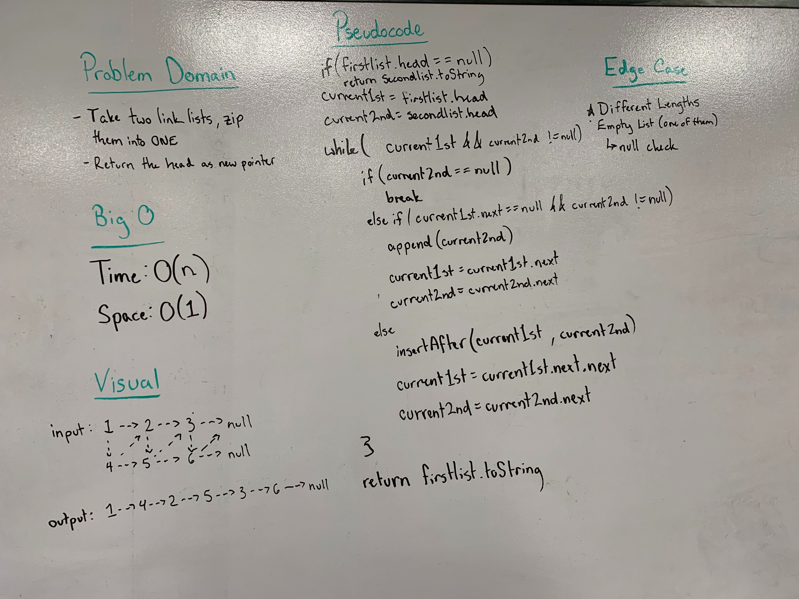

## Linked List Insertions
Write a method which takes in two linked lists and zipper merges them into one list.

### Links
* [LinkedList.java](../code401challenges/src/main/java/linkedList/LinkedList.java) 
* [Node.java](../code401challenges/src/main/java/linkedList/Node.java)
* [LinkedListTest.java](../code401challenges/src/test/java/linkedList/LinkedListTest.java)

### Challenge
* Write a method called `merge` which takes in two linkedlists and does a zipper merge on them to create one linked list. The `merge` returns a reference to the head of the newly merged linked list - this will allow the new linked list to be referenced at a later time.

### Approach and Efficiency
* The method `merge(LinkedList<T> firstList, LinkedList<T> secondList)`
* Time and Space Efficiency
  * `merge(int value)`
    * Time: O(n)
    * Space: O(1)

### Collaboration
* Sapana Poudel

### Solution

