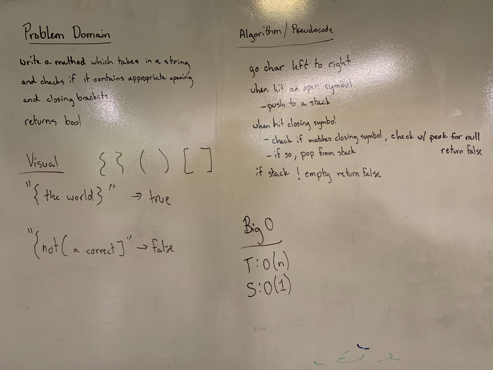

## Multi Bracket Validation
Create a method which takes in a string and checks if all the brackets have the correct opening and closing.

### Links
* src/main/utilities
  * [MultiBracketValidation.java](../code401challenges/src/main/java/utilities/MultiBracketValidation.java)
* src/test/utilities
  * [MultiBracketValidationTest.java](../code401challenges/src/main/java/utilities/MultiBracketValidationTest.java)

### Challenge
Create a method `multiBracketValidation(String input)` which takes in a string value and checks if there are brackets inside of the string and if the brackets have the correctly matching opening and closing pairs. If they do return a value of true, if they do not return a value of false.

### Approach and Efficiency
* Approach:
  * Utilize a stack. Go character by character through the string, when hit an opening bracket push it into the stack. When hit a closing bracket check if it's opening partner matches the peek value of the stack top - if yes, pop the bracket, else return false.
  * if stack is empty return true, else return false;
* Method:
  * `public static boolean multiBracketValidation(String input)`
    * creates an empty stack for opening brackets
    * splits the string into a char array
    * uses a for loop go through the entire char array
      * pushes opening brackets into the stack
      * checks if the chars match the peek value of the stack
        * if not return false
        * if true pop from the stack
    * return `stack.isEmpty()` - this validates if any chars are left in the stack.

* Time and Space:
  * `multiBracketValidation(String input)`
    * T: O(n)
    * S: O(1)

### Collaboration
* Melfi Perez
* Jack Kinne

### Solution
