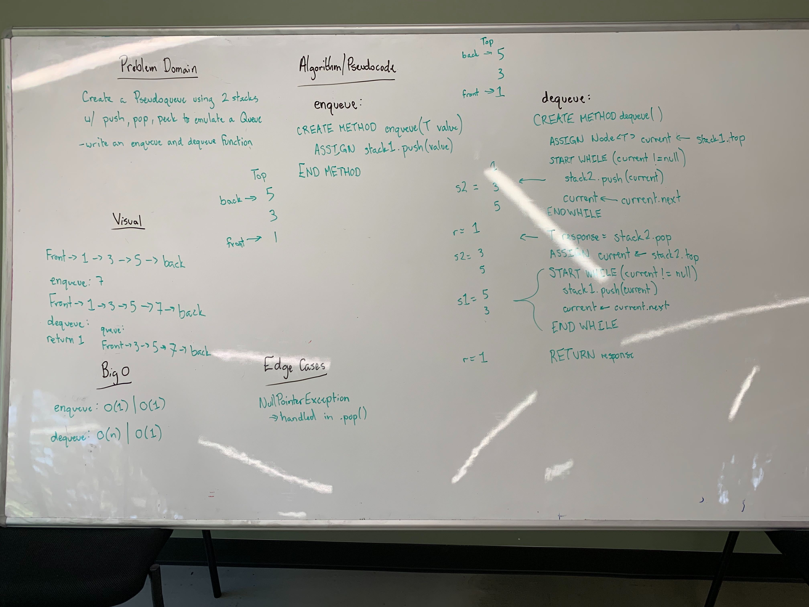

## Pseudoqueue
Create a class which uses two stacks and acts the same as the Class `Queue`.

### Links
* src/main/stacksAndQueues
  * [Node.java](../code401challenges/src/main/java/stacksAndQueues/Node.java)
  * [PseudoQueue.java](../code401challenges/src/main/java/stacksAndQueues/PseudoQueue.java)
  * [Stack.java](../code401challenges/src/main/java/stacksAndQueues/Stack.java)
  * [Queue.java](../code401challenges/src/main/java/stacksAndQueues/Queue.java)
* src/test/stacksAndQueues
  * [PseudoQueueTest.java](../code401challenges/src/test/java/stacksAndQueues/PseudoQueueTest.java)
  * [StackTest.java](../code401challenges/src/test/java/stacksAndQueues/StackTest.java)
  * [QueueTest.java](../code401challenges/src/test/java/stacksAndQueues/QueueTest.java)

### Challenge
Create a class `Pseudoqueue` which utilizes two stacks and has the methods `enqueue(T value)` and `dequeue()` and acts in the same way as the Class `Queue`.

### Approach and Efficiency
* Approach:
  * Utilize the methods `push`, `pop`, and `peek` to move the data between the two stacks to emulate a queue. The `enqueue` will be a simple `push` into `stack1` to create a structure for holding the data. The `dequeue` will utilze two while loops - the first will `pop` the data from `stack1` into `stack2` - this will set the data up to look like a queue (where `top` is `front`) and then assign a response value to `stack2.pop()`. The second while loop will then `push` the values back into `stack1` so new values can use the `enqueue` to be added to the `back` of the queue.
* Variables:
  * `Stack<T> stack1`
  * `Stack<T> stack2`
* Methods:
  * `public void enqueue(T value)`
    * pushes `value` into `stack1`
  * `public T dequeue()`
    * calls `looper(stack1, stack2)`
    * assigns `T front` to `stack2.pop()` to get the "front of the queue value`
    * class `looper(stack2, stack1)`
    * returns `front`
  * `private void looper(Stack<T> stackToPopFrom, Stack<T> stackToPushInto)`
    * loops through `stackToPopFrom` while not empty
      * pushes into `stackToPushInto` the popped value from `stackToPopFrom`
  * `public boolean isEmpty()`
    * checks if `stack1.getTop() == null && stack2.getTop() == null`
    * returns true if both are empty, returns false if either is not
  * `public String toString()`
    * if queue is empty returns "Queue is empty"
    * else:
      * uses a StringBuilder to build the response
      * calls `looper(stack1, stack2)`
      * appends `setToString(stack2.getTop())`
      * calls `looper(stack2, stack1)`
      * returns the response
  * `private String setToString(Node<T> node)`
    * recursively builds a string response
* Time and Space:
  * T: O()
  * S: O()

### Collaboration
* Not at this time

### Solution
