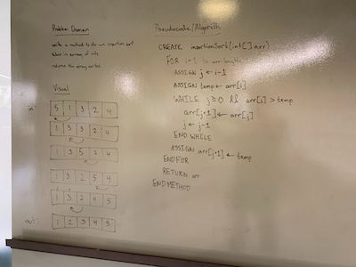
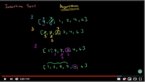

# Insertion Sort
#### Code
[Insertion Sort](InsertionSort.java)
[Insertion Sort Test](../../test/java/insertionSort/InsertionSortTest.java)

#### Description
The insertion sort is a sorting method which is most effective on an array of limited size. This sort compares an element within the array to the next value and checks to see if it is greater than that element and moves the current element to the checked elements position (if the checked element is less than the current).

The insertion sort is similar in style to organizing a set of card in your hand - you move one element at a time until all the elements are in order going from smallest to largest.

#### Effectiveness
Time and Space:
* Time: O(n^2)
* Space: O(1)

The insertion sort is not the most effective sort when looking at time complexity. The time complexity is n^2 because the search involves a `while` loop nested inside a `for` loop. Space complexity is considered constant because no new heap or stack space is required to compute this method.

## Learning Objectives
* Understand the problem domain - input, expected changes, output
* Understand the algorithm
* Apply the algorithm to Pseudocode
* Understand the time and space complexity

## Visual


## Algorithm
* Take in an array of integers
* Loop over the array to go through each value, start the loop at index 1
  * Assign a variable `j` to `i - 1` to get the previous index value
  * Assign a temp variable to the array at i to not lose the value when swapping
  * Iterate while `j >= 0` and `arr[j] > temp` to check all values against j and swap them as needed
  * Reassign the array @ j+1 to the temp value.
* Return the array once the initial loop has ended (all values checked)

### Pseudocode
```
  InsertionSort(int[] arr)
  
    FOR i = 1 to arr.length
    
      int j <-- i - 1
      int temp <-- arr[i]
      
      WHILE j >= 0 AND temp < arr[j]
        arr[j + 1] <-- arr[j]
        j <-- j - 1
        
      arr[j + 1] <-- temp
```

## Readings and References
### Watch
[](https://www.youtube.com/watch?v=lCzQvQr8Utw)

### Read
* [Khan Academy Insertion Sort](https://www.khanacademy.org/computing/computer-science/algorithms/insertion-sort/a/insertion-sort)
* [Geeks for Geeks Insertion Sort](https://www.geeksforgeeks.org/insertion-sort/)
* [Hacker Earth Insertion Sort](https://www.hackerearth.com/practice/algorithms/sorting/insertion-sort/tutorial/)
