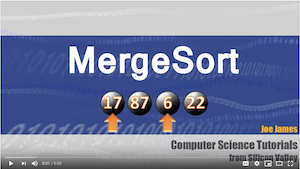

# Merge Sort
#### Code
* [Merge Sort](MergeSort.java)
* [Merge Sort Test](../../../test/java/mergeSort/MergeSortTest.java)

#### Description
The merge sort is a divide and conquer method. It utilizes a recursive method to divide an array into sub arrays until it is down to two elements and then checks to see which element is smaller than the other and sorts those against each other.

The merge sort will use two methods:
* `mergeSort(int[] arr, int len)`
* `merge(int[] arr, int[] left, int[] right, int l, int r)`

#### Effectiveness
Time and Space:
* Time: O(n)
* Space: O(n)

The merge sort is in overall efficient method - it takes much less time than insertion sort - n time instead of n^2 time. However, it takes n space because of the stack space used in the recursive call.

## Learning Objectives
* Understand the problem domain - input, expected changes, output
* Understand the algorithm
* Apply the algorithm to Pseudocode
* Understand the time and space complexity

## Visual


### Pseudocode / Algorithm
```
CREATE METHOD mergeSort(int[] arr, int len)
  CHECK if len < 2, return if true
  ASSIGN mid <- half length
  ASSIGN int[] left <- int[] size of mid
  ASSIGN int[] right <- int[] size of len - mid
  
  FOR i = 0 to i < mid
    ASSIGN left[i] <- arr[i]
  END FOR
  
  FOR i = mid to i < len
      ASSIGN right[i - mid] <- arr[i]
  END FOR
  
  RECURSIVE call to mergeSort(left, mid)
  RECURSIVE call to mergeSort(right, len - mid)
  CALL helper method merge(arr, left, right, mid, len - mid)
END METHOD
```
```
CREATE METHOD merge(int[] arr, int[] left, int[] right, int l, int r)
  ASSIGN i, j, and k <- 0
  WHILE i < l and j < r
    IF (left[i] <= right[j]
      arr[k++] <- left[i++]
    ELSE
      arr[k++] <- right[j++]
    END IF
  END WHILE
  WHILE i < l
    arr[k++] <- left[i++]
  END WHILE
  WHILE j < r
    arr[k++] <- right[j++]
  END WHILE
END METHOD
```

## Readings and References
### Watch
[](https://www.youtube.com/watch?v=iMT7gTPpaqw)

### Read
* [Baeldung Merge Sort](https://www.baeldung.com/java-merge-sort)
* [Geeks for Geeks Merge Sort](https://www.geeksforgeeks.org/merge-sort/)
